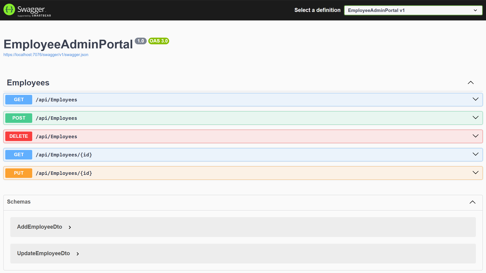
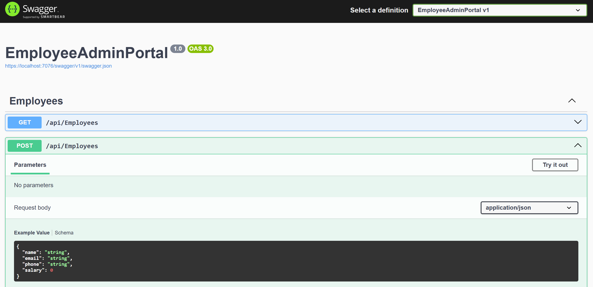
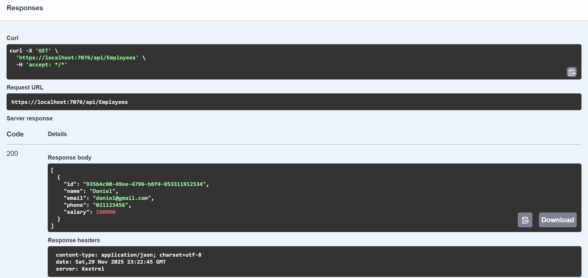

# ASP.NET Web API Project – EmployeeAdminPortal with CRUD Operations using Entity Framework Core

## Objective  
The **EmployeeAdminPortal** project demonstrates how to build a complete **ASP.NET Web API** using **.NET 8**, **Entity Framework Core**, and a **code-first** approach to interact with a **SQL Server** database.

The API supports full **CRUD operations** (Create, Read, Update, Delete) for managing employee data and serves as a practical learning project for understanding RESTful API development in ASP.NET Core. These operations helped build my understanding of REST API development using EF Core, dependency injection, and controller-based routing.

This project is based on concepts from the tutorial provided by Sameer Saini: 
👉 **[ASP.NET Core Web API CRUD Operations Tutorial](https://www.youtube.com/watch?v=6YIRKBsRWVI)**

## Skills Learned

### EmployeesController.cs:
- Learned how routing works in an API controller using attribute routing with `[Route("api/[controller]")]`, which maps incoming HTTP requests to the appropriate endpoints under `api/employees`.  
  - Understood how the controller inherits from `ControllerBase`, providing built-in features such as model binding, HTTP response helpers (e.g., `Ok()`, `NotFound()`), and attribute support for REST API development.  
  - Saw how dependency injection is used to supply the controller with an instance of `ApplicationDbContext`, allowing it to interact with SQL Server through Entity Framework Core.

### CRUD Operations using HTTP Methods:
- **Read All Employees (`GET`)**  
Implemented an endpoint that retrieves all employees using:  
`dbContext.Employees.ToList();`

- **Read Employee by ID (`GET /{id}`)**  
Added logic to find an employee by GUID, returning `NotFound()` when the employee does not exist.

- **Create Employee (`POST`)**  
Developed functionality to map `AddEmployeeDto` to an `Employee` entity, save it to the database, and return the created record.

- **Update Employee (`PUT /{id}`)**  
Implemented update logic for modifying **Name**, **Email**, **Phone**, and **Salary** only if the employee exists.

- **Delete Employee (`DELETE`)**  
Created deletion logic that ensures the employee exists before removing them from the database.

### Data Integration:  
  - Configured the `ApplicationDbContext` to manage database operations.  
  - Practiced creating and applying EF Core migrations to generate and update the database schema.  
  - Verified stored records using SQL Server Management Studio (SSMS).

---

## Project Setup Steps

## Step 1. Install Required NuGet Packages  
- Microsoft.EntityFrameworkCore  
- Microsoft.EntityFrameworkCore.Tools  
- Microsoft.EntityFrameworkCore.SqlServer  

## Step 2. Configure SQL Server Connection String  

#### DB Connection String References  
- **MSDN:** https://bit.ly/3wQFY1T  
- **CSharp.net:** https://bit.ly/3J79raF  

Add your SQL Server connection string in **appsettings.json**:

```json
"ConnectionStrings": {
  "DefaultConnection": "Server=localhost;Database=EmployeesDb;Trusted_Connection=True;MultipleActiveResultSets=true;TrustServerCertificate=True" 
}
```

Configure DbContext in Program.cs  

```csharp
// Depnedency injection for DbContext 
builder.Services.AddDbContext<ApplicationDbContext>
(options => options.UseSqlServer(builder.Configuration.GetConnectionString("DefaultConnection")));
``` 
## Step 3. Create and Apply Entity Framework Core Migrations for the Database

Open **Package Manager Console**:

### Create the migration
```powershell
Add-Migration "Initial Create"
```
```powershell
Update-Database
```

## Images of EmployeeAdminPortal Project 

## Swagger HTTP Methods 
 

## Employee Post Request 
 

## Employee GET Response 

